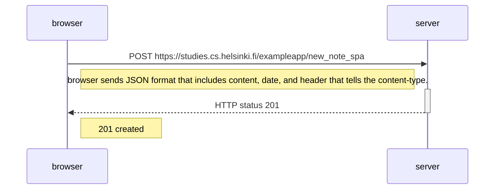

```mermaid
sequenceDiagram

participant browser
participant server

 browser->>server: POST https://studies.cs.helsinki.fi/exampleapp/new_note_spa

 note right of browser: browser sends JSON format that includes content, date, and header that tells the content-type.

    activate server
    server-->>browser: HTTP status 201
    deactivate server

    note right of browser: 201 created


```
 