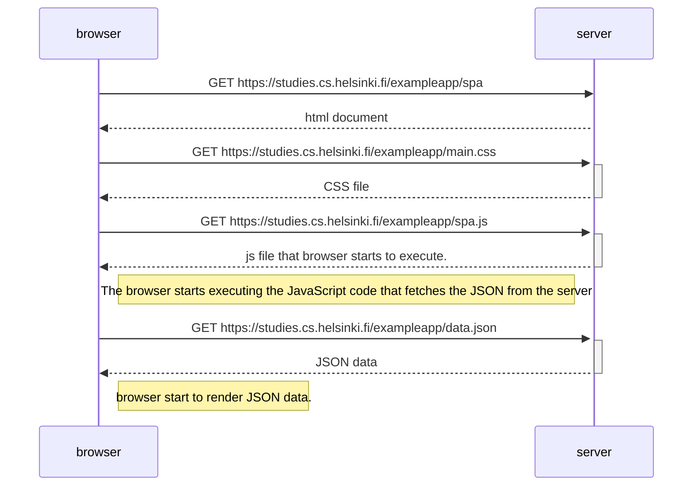

```mermaid
sequenceDiagram

participant browser
participant server

 browser->>server: GET https://studies.cs.helsinki.fi/exampleapp/spa
activate server
server-->>browser: html document
 

browser->>server: GET https://studies.cs.helsinki.fi/exampleapp/main.css

    activate server
    server-->>browser: CSS file
    deactivate server

    browser->>server: GET https://studies.cs.helsinki.fi/exampleapp/spa.js

activate server
server-->>browser: js file that browser starts to execute.
 deactivate server

  Note right of browser: The browser starts executing the JavaScript code that fetches the JSON from the server

    browser->>server: GET https://studies.cs.helsinki.fi/exampleapp/data.json

activate server
server-->>browser: JSON data
deactivate server

note right of browser: browser start to render JSON data.

```
 